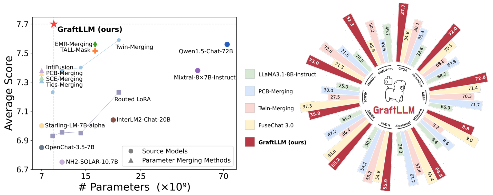
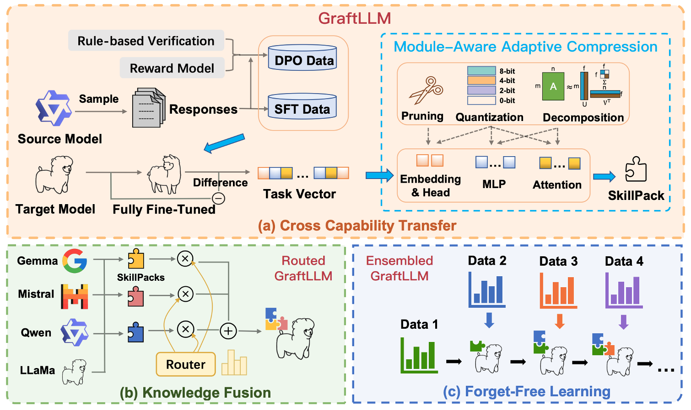

# GraftLLM: Knowledge Grafting of Large Language Models

This is the source code to reproduce the experiments for "[Knowledge Grafting of Large Language Models](https://arxiv.org/abs/2505.18502)" by Guodong Du, Xuanning Zhou, Junlin Lee, Zhuo Li, Wanyu Lin, Jing Li.

our key contributions include:
(1) We highlight the necessity of cross-capability transfer between heterogeneous large language models and identify limitations in existing methods regarding generalization and adaptability. (2) We propose **GraftLLM**, which structures cross-model capabilities as SkillPack, offering high performance, forgetfulness resistance, and easy integration for practical applications. 
(3) Experiments show GraftLLM significantly improves performance in knowledge transfer and compression, heterogeneous model fusion, and continual learning tasks.



# 💡 Quick Start
## Install
```
conda create -n GraftLLM python=3.9

conda activate GraftLLM

pip install -r requirements.txt 
```
## SFT+DPO

We used [Llama-Factory](https://github.com/hiyouga/LLaMA-Factory) as our fine-tuning library. For all target models, we fine-tuned for 3 epochs, with a batch size of 128 and a maximum sequence length of 2048 tokens. A cosine learning rate schedule with a warmup ratio of 0.1 is employed. We used [alignment-handbook](https://github.com/huggingface/alignment-handbook) as our DPO training library. For all Target SFT models, we trained for 1 epoch with a batch size of 128, set maximum sequence length to 2048, used cosine learning rate with a warmup ratio of 0.1. For Llama-3.1 models, we introduced length normalization in DPO training, as shown in [FuseChat 3.0](https://github.com/fanqiwan/FuseAI/tree/main/FuseChat-3.0).

```
bash run.sh  # to run llama models, see run.sh for more specific details.
```

## Adaptive Compression
```
See ./Adaptive-Compression for for more details.
```

## Evaluation
```
See ./GraftLLM-Evaluation for for more details.
```

# 🌈 Method
GraftLLM transfers capabilities across heterogeneous LLMs and extracts them into compact SkillPacks, facilitating efficient knowledge fusion and continual learning.


